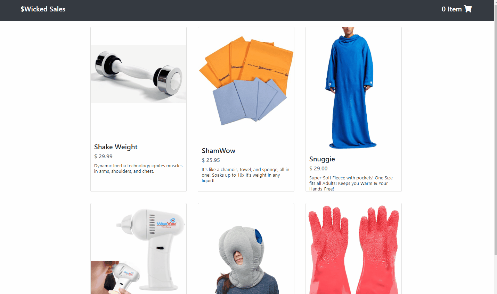

# wicked-sales-js
A full stack Node.js and React application for shoppers who want to build a shopping cart and buy items.

## Technologies Used
- React.js
- Webpack 4
- Node.js
- PostgreSQL
- AWS EC2
- HTML5
- Bootstrap 4
- CSS3

## Live Demo
Try the application live at https://catalog.baileyohill.com/

## Features
- Shopper can view catalog.
- Shopper can view cart.
- Shopper can view checkout.
- Shopper can add items to their cart.
- Shopper can input their information at checkout.

## Preview

## Development
### System Requirements
  - Node.js 10 or higher.
  - NPM 6 or higher.

### Getting Started
1. Clone the repository.

  - `git clone https://github.com/bailey-hill/wicked-sales-js`
  - `cd wicked-sales-js`

2. Install all dependencies with NPM.
  - `npm install`

3. Import the example database to postgres database.
  - `npm run db:import`

4. Start the project. Once started you can view the application by opening http://localhost:3000 in your browser.
  - `npm run dev`
